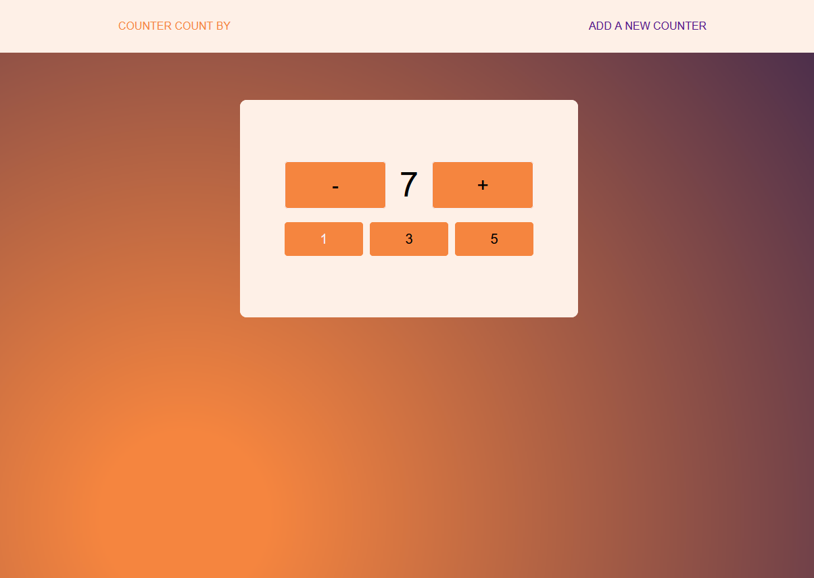
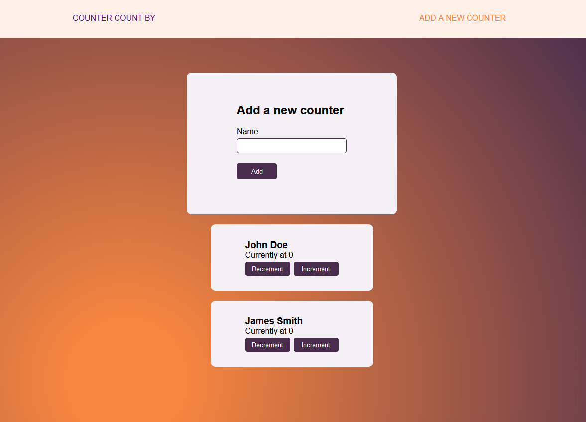

# Angular Counter

Incremental and decremental counter using Angular with NgRx.

## Browser Compatibility

All of the latest versions of <b>Chrome</b>, <b>Firefox</b>, <b>Edge</b> and <b>Opera</b> browsers are supported.

## Installation

#### Steps to install

<ol>
  <li>download the folder/git clone the repo</li>
  <li>cd root directory of the folder</li>
  <li>npm install</li>
  <li>ng serve -o</li>
  <li>access localhost:4200 on your browser</li>
</ol>

## Screenshots

Counter count by page with counter by 1.

Add a new counter page with input and Add button. Screenshot also shows the input of the name with the Increment and Decrement buttons.

See code <a href="https://github.com/veronikagregorec/angular-counter/tree/main/src/app" target="_blank">here</a>

[Back to the top](#angular-counter)
